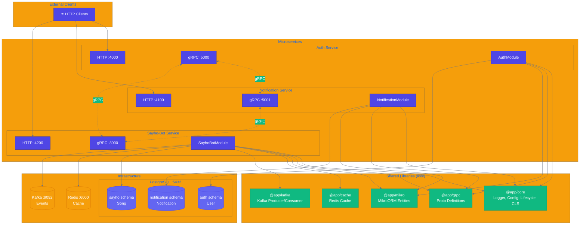

# Elivagar Architecture

## Overview

Elivagar는 NestJS 기반 마이크로서비스 모노레포로, 3개의 독립적인 서비스가 gRPC를 통해 통신합니다.

## Architecture Diagram



## Microservices

### Auth Service

| 항목 | 값 |
|------|-----|
| HTTP Port | 4000 (`AUTH_PORT`) |
| gRPC Port | 5000 (`AUTH_GRPC_PORT`) |
| DB Schema | `auth` |
| 주요 엔티티 | User |
| Proto Service | `auth.v1.AuthService` |

**역할**: 사용자 인증 및 JWT 토큰 발급

### Notification Service

| 항목 | 값 |
|------|-----|
| HTTP Port | 4100 (`NOTIFICATION_PORT`) |
| gRPC Port | 5001 (`NOTIFICATION_GRPC_PORT`) |
| DB Schema | `notification` |
| 주요 엔티티 | Notification |
| Proto Service | `notification.v1.NotificationService` |

**역할**: 알림 발송 및 관리

### Sayho-Bot Service

| 항목 | 값 |
|------|-----|
| HTTP Port | 4200 (`SAYHO_BOT_PORT`) |
| gRPC Port | 8000 (`SAYHO_BOT_GRPC_PORT`) |
| DB Schema | `sayho` |
| 주요 엔티티 | Song |
| Proto Service | `sayhoBot.v1.SayhoBotService` |
| 추가 의존성 | Redis Cache, Kafka |

**역할**: 봇 서비스, 이벤트 스트리밍 처리

## Shared Libraries

### @app/core

전역 공유 기능 제공

- **LoggerModule**: Winston 기반 로깅
- **LifecycleModule**: 연결 생명주기 관리, Graceful Shutdown
- **ClsModule**: 요청 컨텍스트 (Continuation Local Storage)
- **ConfigsService**: 환경 변수 기반 설정 관리

### @app/grpc

gRPC 통신 모듈

- Proto 파일 위치: `libs/grpc/src/proto/{service}/v1/{service}.proto`
- 생성된 코드: `libs/grpc/src/proto/generated/`
- 메시지 크기 제한: 10MB
- Keepalive: 30초 간격

### @app/mikro

MikroORM 데이터베이스 추상화

- **드라이버**: PostgreSQL
- **엔티티 베이스 클래스**:
  - `MikroEntity`: 타임스탬프 + Soft Delete
  - `MikroUuidEntity`: UUID 기본키 (UUIDv7)
  - `MikroAutoIncrementEntity`: Auto Increment 기본키
- **마이그레이션**: `libs/mikro/migrations/{service}/`

### @app/cache

Redis 캐시 모듈

- **기술 스택**: @nestjs/cache-manager + Keyv + @keyv/redis
- **기능**: 네임스페이스 격리, TTL, Single-flight 패턴
- **생명주기**: `IManagedConnection` 구현

### @app/kafka

Kafka 메시징 모듈

- **기술 스택**: KafkaJS + NestJS Microservices
- **기능**: Producer/Consumer, SASL 지원
- **Shutdown 우선순위**: 20 (가장 먼저 종료)

## Infrastructure

### PostgreSQL

```
Host: localhost:5432
Database: elivagar
User: elivagar
```

**스키마 분리**:
- `auth` - Auth 서비스 전용
- `notification` - Notification 서비스 전용
- `sayho` - Sayho-Bot 서비스 전용

### Redis

```
Host: localhost:6000
```

**용도**: 캐시, 세션 저장소

### Kafka

```
Host: localhost:9092
Cluster ID: elivagar-kafka-cluster-001
```

**용도**: 비동기 이벤트 스트리밍

## Communication Patterns

### HTTP (외부 → 서비스)

```
Client → Auth Service (:4000)
Client → Notification Service (:4100)
Client → Sayho-Bot Service (:4200)
```

### gRPC (서비스 간 동기 통신)

```
Auth ←→ Notification
Auth ←→ Sayho-Bot
Notification ←→ Sayho-Bot
```

### Kafka (비동기 이벤트)

```
Sayho-Bot → Kafka Broker → Consumers
```

## Lifecycle Management

### Startup Sequence

1. ConfigModule 로드 및 환경 변수 검증
2. CoreModule 초기화 (Logger, Lifecycle, CLS, MikroORM)
3. GrpcModule 등록
4. 서비스별 모듈 import
5. `app.init()` - OnModuleInit 훅 트리거
6. ConnectionRegistryService에 연결 등록
7. ReadinessGateService.waitForReady() - 모든 연결 대기 (30초 타임아웃)
8. gRPC 마이크로서비스 시작
9. HTTP 서버 리스닝 시작

### Shutdown Sequence

1. **Grace Period** (5초): 로드밸런서 등록 해제 대기
2. **Drain Phase**: 각 연결별 대기 작업 처리
3. **Close Phase**: 우선순위 순서로 연결 종료
   - Kafka (priority: 20) - 가장 먼저
   - Redis (priority: 10)
   - Database (priority: 0) - 가장 마지막
4. 애플리케이션 종료

## Environment Variables

### Prefixed Variables (서비스별)

| Prefix | 서비스 |
|--------|--------|
| `AUTH_*` | Auth Service |
| `NOTIFICATION_*` | Notification Service |
| `SAYHO_BOT_*` | Sayho-Bot Service |

### Shared Variables (Fallback)

| 변수 | 용도 |
|------|------|
| `DB_*` | PostgreSQL 연결 |
| `REDIS_*` | Redis 연결 |
| `KAFKA_*` | Kafka 연결 |
| `JWT_*` | JWT 설정 |

## Directory Structure

```
elivagar/
├── apps/
│   ├── auth/                 # Auth 서비스
│   ├── notification/         # Notification 서비스
│   └── sayho-bot/            # Sayho-Bot 서비스
├── libs/
│   ├── core/                 # 공유 코어 모듈
│   ├── grpc/                 # gRPC 설정 및 Proto
│   ├── mikro/                # MikroORM 설정
│   ├── cache/                # Redis 캐시 모듈
│   └── kafka/                # Kafka 모듈
├── docker/
│   └── compose.local.yml     # 로컬 인프라 Docker Compose
└── docs/
    └── architecture.md       # 이 문서
```
